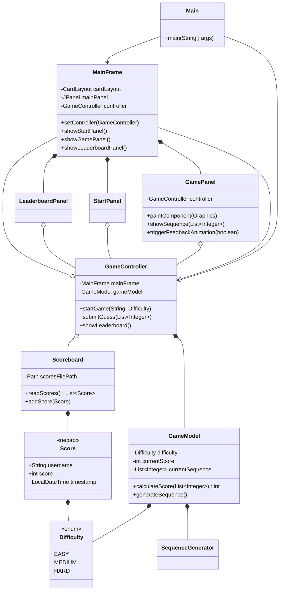

# Design Document - Memory Game

This document outlines the design and architecture of the Java Swing Memory Game.

## 1. Architecture

The application follows a Model-View-Controller (MVC) design pattern to separate concerns, making the codebase more modular, testable, and easier to maintain.

-   **Model:** The Model represents the application's data and business logic. It is completely independent of the UI.
    -   `GameModel`: Holds the state of the current game session (score, level, difficulty).
    -   `Score`, `Difficulty`: Data records/enums.
    -   `SequenceGenerator`: Business logic for creating number sequences.
    -   `Scoreboard`: Handles the business logic of reading/writing scores to the filesystem.

-   **View:** The View is responsible for the presentation layer (the UI). In this project, it consists of all the Swing components.
    -   `MainFrame`: The main `JFrame` window.
    -   `GamePanel`, `StartPanel`, `LeaderboardPanel`: `JPanels` that represent different screens of the application. They are responsible for drawing the UI and displaying data from the Model.

-   **Controller:** The Controller acts as an intermediary between the Model and the View. It handles user input, updates the Model, and tells the View when to update.
    -   `GameController`: Manages the game flow, state transitions, and user actions. It listens to events from the View (e.g., button clicks) and updates the `GameModel` accordingly.

## 2. Class Diagram (Mermaid)

## 3. Key Design Choices

-   **Swing for UI:** As per requirements, standard Swing (`javax.swing`) is used for the entire UI.
-   **Maven for Build:** Maven handles dependency management (JUnit) and packaging, providing a standard build lifecycle. The `maven-shade-plugin` is used to create a single, executable JAR.
-   **CSV for Persistence:** The leaderboard is stored in a simple, human-readable CSV format in the user's home directory (`~/.memorygame/scores.csv`). This avoids the need for a database or more complex serialization formats.
-   **`javax.swing.Timer` for Animations:** All animations (number reveals, feedback) and game delays are handled by `javax.swing.Timer`. This is crucial for Swing applications as it ensures that UI updates happen on the Event Dispatch Thread (EDT), preventing threading issues.
-   **`java.nio` for File I/O:** Modern `java.nio.file` APIs are used in the `Scoreboard` class for robust and efficient file handling.
-   **Stateless Rendering:** The `GamePanel` is designed to be mostly stateless. Its `paintComponent` method renders the current state based on the `GameModel` and internal animation state variables. This makes the rendering logic easier to reason about.
